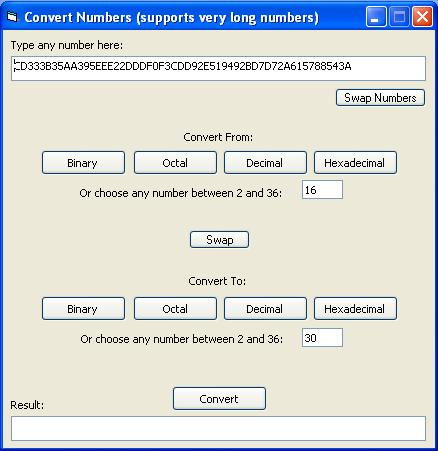

<div align="center">

## Convert Numbers v1\.5\(Binary, Octal, Decimal, Hex and other\.\.\.\) supports very long numbers


</div>

### Description

This program converts numbers in a number system to numbers in another number system

like Hex to Decimal or binary to Hex etc., see the word document to know how to convert. There is a useful graphical function,this function flashes a window or an object using its back color

v1.5 - over flow error has fixed, write numbers as long as you can! how it's fixed... see the word document atached with this submission
 
### More Info
 
Input a HUGE number and choose the 2 number systems of the number to convert and the result.

Get the result according to inputs

There is a useful graphical function,this function flashes a window or an object using its back color


<span>             |<span>
---                |---
**Submitted On**   |2009-11-15 16:35:10
**By**             |[Saed abumokh](https://github.com/Planet-Source-Code/PSCIndex/blob/master/ByAuthor/saed-abumokh.md)
**Level**          |Intermediate
**User Rating**    |4.3 (17 globes from 4 users)
**Compatibility**  |VB 6\.0
**Category**       |[Math/ Dates](https://github.com/Planet-Source-Code/PSCIndex/blob/master/ByCategory/math-dates__1-37.md)
**World**          |[Visual Basic](https://github.com/Planet-Source-Code/PSCIndex/blob/master/ByWorld/visual-basic.md)
**Archive File**   |[Convert\_Nu21679411162009\.zip](https://github.com/Planet-Source-Code/saed-abumokh-convert-numbers-v1-5-binary-octal-decimal-hex-and-other-supports-very-long-nu__1-72564/archive/master.zip)

### API Declarations

```
Private Declare Function GetTickCount _
Lib "kernel32" Alias "GetTickCount" () As Long
```


